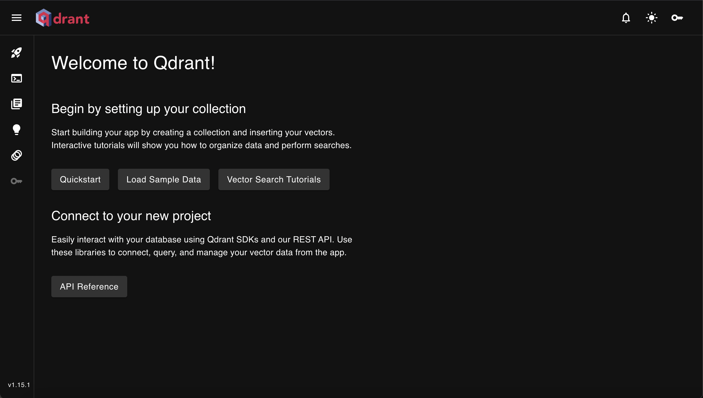
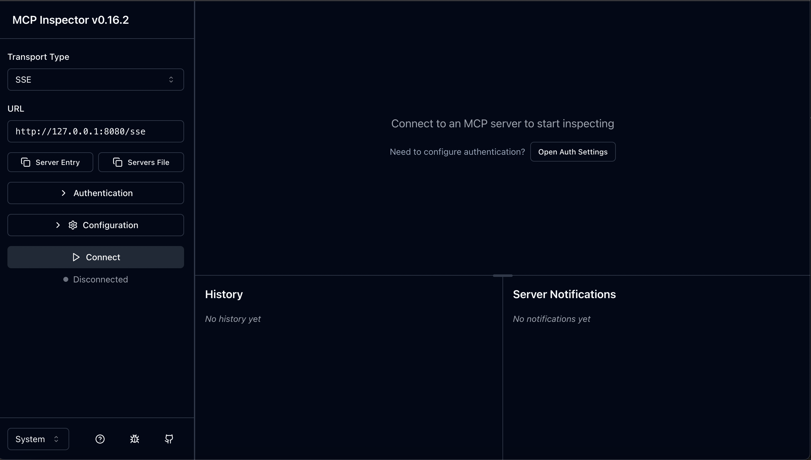
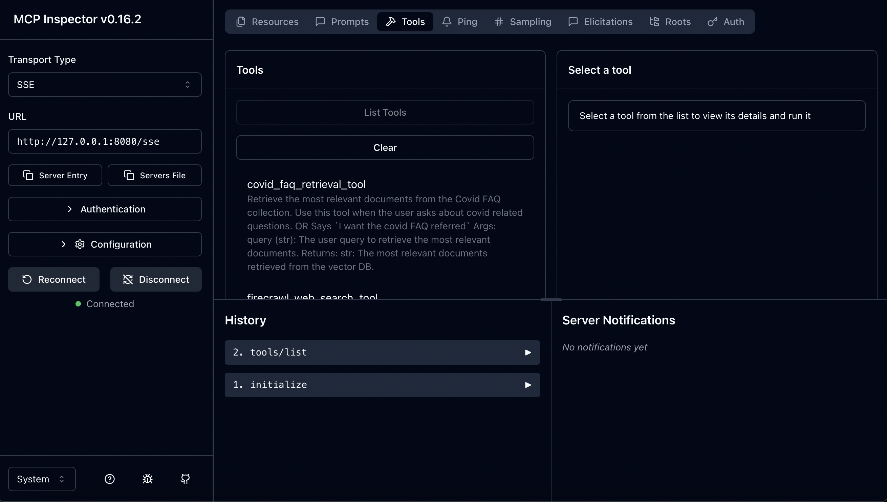
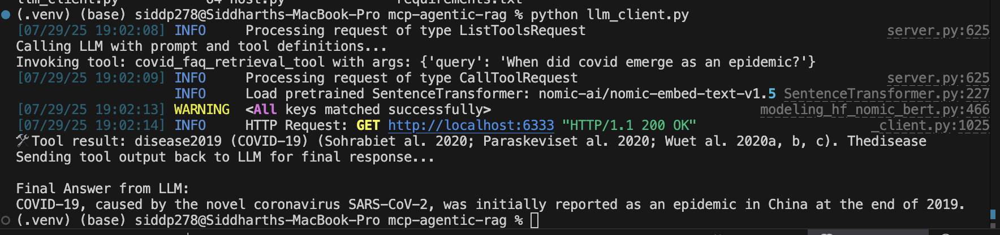

# mcp-searchEngine

## Developing a RAG application based on MCP Architecture

This is a proof-of-concept project for a Retrieval-Augmented Generation (RAG) application using the Model Context Protocol (MCP). The application answers COVID-related queries using a combination of:

- A Qdrant-based vector database storing parsed documents,
- A web-crawling tool using FireCrawl to extract relevant live data from the internet,
- An MCP server that exposes these tools,
- An LLM client (e.g., GPT-4o) that calls these tools dynamically to generate responses.

---

## Setup Instructions
1. git clone the project
2. Get the covid data [here](https://drive.google.com/drive/folders/1jWj_uEqpvtV1hl0WJnNgVRxp2ICk9UiJ?usp=sharing)
3. pip install all depdencies of the project - pip install -r requirements.txt
4. Activate the environment and setup an .env file to keep secrets (or directly use github secrets)
5. Check Qdrant vector db setup
6. Check web-crawler setup using FireCrawl
7. Finally running the MCP server-client app

### 1. Clone the project
```bash 
mkdir my_project 
git clone <repo-url>
# Navigate into it 
cd mcp-searchEngine
 ```

 ### 2. Get data for covid research
 Get the covid data [here](https://drive.google.com/drive/folders/1jWj_uEqpvtV1hl0WJnNgVRxp2ICk9UiJ?usp=sharing)

### 3. Installing depedencies
Install all depdencies of the project - 
 NOTE: Activate the environment and setup an .env file to keep secrets (or directly use github secrets) before installing the depedencies
```bash 
pip install -r requirements.txt
 ```
### 4. Qdrant vector db setup
Qdrant is an open source vector database and similarity search engine designed to handle high-dimensional vectors for performance and massive-scale AI applications.

We run the qdrant database inside a docker container to keep the database isolated. You can spin up the database pretty easily using the below command - 
```bash
  docker run -p 6333:6333 -p 6334:6334 \
    -v $(pwd)/qdrant_storage:/qdrant/storage \
    qdrant/qdrant
```

You can access the database UI with - http://localhost:6333/dashboard#/welcome



Once the database is ready, run the python file `create_vectors.py`. This python logic creates vectors from pdf docuemnts of your file (covid research files in my case) and setups a point of reference (collection) in the database, which you can reach to sarch and index later on.
P.S. Keep the batch size small if you have weak computation power like me :/

Once the vectors are created, you can use `get_vectors.py` file to test out the collection and how it fares to your queries.

### 5. Web-crawler setup using FireCrawl
FireCrawl is a web scraping tool that extracts data from websites and converts it into a structured, LLM-ready format, specifically Markdown. We ustilize the free capabilities provided by FireCrawl, that is utlizing seach index of web pages over the internet.

You can run `web_crawl.py` to test out your query against the most relevent web-pages over the internet

### 6. Finally running the MCP server-client app
The server is setup with two ways of information transport - stdio and sse. 
Check out the `mcp_server.py` file to understand how the MCP server is configured. We add our tools there for the LLM to use them through the client. I have just added tools are required by the POC requirements, but we can register (add) resources and prompts too.

Testing the MCP server -
Once the server configuration is set up, we can test if the MCP server is able to pick up the tools are required and if the tools are working as intended through a nodejs application.
Run the application through shell -  
```bash
npx @modelcontextprotocol/inspector
```



Based on the Network transport type (data transfer) select stdio or sse and connect. If everything is has been st up correctly, then you will be able to connect and and in the tools section upon calling get tools it should show you your tools configured in `mcp_server.py` file. You can try out the tools from there too after selecting the tool.


Testing the MCP Client - 
You can run the client which hosts gpt-4o LLM (since o4-mini doesnt support MCP) with `llm_client.py` file. Currenlty it supports only chat completion, so you can change the prompt in the file and see the MCP server and host running in tandum to formulate the final asnwer using the tools.


- Things to note:
1. This is just a POC so not production ready, unwarranted actiions or weird exceptions aren't handled yet :)
2. o4-host.py file has a client interface using gpt-4o as host Agent-LLM (through Azure AI Foundry), but the MCP server needs to be on Azure platform (hosted there) for the model to reach the tools.

- Additions in the future:
1. Integration of my mcp server with claude destop to provide conversational ability with user
2. Conversational ability within llm_client itself.
3. Creating an agent in Azure AI Foundry and connecting MCP server to the agent in Azure.
4. Refactor the code to be production ready. 
